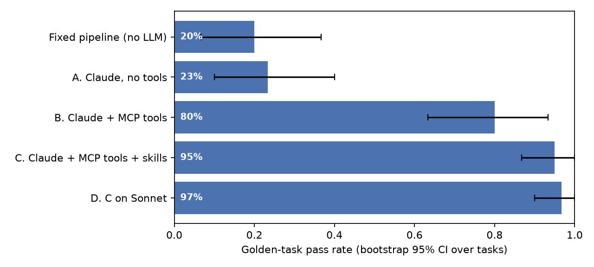

# CMG Deep Claude Agent

A healthcare-evidence agent that uses **Claude Code as its agent runtime**. It answers Commercial, Medical, and Government Affairs (CMG) questions about drug labels, clinical trials, and Medicare coverage, using live public data through a **Model Context Protocol (MCP)** server and four reusable **Agent Skills**. Every answer is graded by a program that checks each cited quote word for word against the source the agent actually retrieved.

> Research prototype on public data only. Not medical advice and not promotional content. No PHI.

## Results

30 golden tasks, graded automatically. Pass rate is per task with a bootstrap 95% CI over tasks; A to C were run twice per task.

| Configuration | Pass rate (95% CI) | Claims verified | Cost / task* | Median latency |
|---|---|---|---|---|
| Fixed pipeline, no LLM (the original version of this repo) | 20% (7 to 37%) | n/a† | $0 | 0.1 s |
| A. Claude Haiku, no tools | 23% (10 to 40%) | 0% | $0.0014 | 10 s |
| B. Claude Haiku + MCP tools | 80% (63 to 93%) | 89% | $0.0025 | 11 s |
| **C. Claude Haiku + MCP tools + skills** | **95% (87 to 100%)** | **94%** | **$0.0033** | **14 s** |
| D. Configuration C on Claude Sonnet | 97% (90 to 100%) | 94% | $0.0532 | 16 s |

\* API list price computed from measured token usage. Latency is wall-clock for the whole agent run through headless Claude Code.  
† The pipeline's claims are raw excerpts of what it fetched, so they verify by construction; it fails on choosing the product, refusing, and reporting not-found.



**What the numbers say**

- **Agent vs fixed pipeline: +75 points** (paired 95% CI +60 to +90). The pipeline matched drug names against a hard-coded list, so it answered most questions about the wrong product, never refused, and never reported "not found".
- **Tools: +57 points.** Without tools, none of Claude's 210 claims could be traced to a retrieved source, and 4 runs cited NCT IDs that do not exist. With tools: zero invented trial IDs in every configuration.
- **Skills: +15 points** (paired CI +2 to +30). Skills fixed refusals (50% to 100%), off-label questions (0% to 100%), and ambiguous product names such as KEYTRUDA vs KEYTRUDA QLEX (67% to 100%), and cut MCP tool calls per task from 3.8 to 2.6.
- **Sonnet vs Haiku: +2 points at 16x the cost.** For this workload, Haiku with skills is the better default.
- **Remaining failures are over-escalation** (flagging human review when not required), never a wrong product, an unverifiable claim passing, or a missed refusal.

Full ablation analysis, failure taxonomy, and cost/quality chart: [agentbench-cmg](https://github.com/Akhilesh-Vangala/agentbench-cmg).

## How it works

```
User question
   │
   ▼
Claude Code, headless (claude -p)  ── system prompt + JSON output schema
   │  loads skills on demand:  fda-label-lookup · cited-evidence · trial-landscape · review-escalation
   │
   ├── MCP server "cmg" (stdio, python -m cmg_agent.mcp_server)
   │      fda_search_labels      fda_get_label_section   (openFDA, paged)
   │      trials_search          trials_get              (ClinicalTrials.gov v2)
   │      cms_ncd_search         cms_ncd_get             (CMS Coverage API, NCDs)
   │      └─ every document returned is logged to the run's evidence.jsonl with a source_id
   ▼
Structured answer: status · summary · claims[statement, source_id, quote] · needs_human_review · review_reasons
   │
   ▼
Verifier (src/cmg_agent/verify.py)
   claim verified  ⇔  source_id was retrieved in this run  AND  quote is a verbatim substring of it
   task passed     ⇔  every declared check holds (right product, required sections, status, review flag, no invented NCT IDs)
```

### Skills (`agent_workspace/.claude/skills/`)

| Skill | What it encodes |
|---|---|
| `fda-label-lookup` | Search, then pick the exact product when names collide; never borrow warnings text and call it a boxed warning; `not_found` rules |
| `cited-evidence` | Quote discipline that the verifier enforces (verbatim, 1 to 3 sentences, source_id copied from a tool result) |
| `trial-landscape` | Trial search procedure; a trial existing is not evidence that a drug works |
| `review-escalation` | When to flag human review (comparative claims, off-label, coverage, ambiguous product, missing evidence) and when to refuse (promotional copy, superiority claims, individual patient advice) |

### Golden tasks (`evals/golden/agent_tasks.json`)

| Category | Tasks | What is checked |
|---|---|---|
| Label questions | 12 | Correct product's label, required section cited, no fabricated boxed warning (Ocrevus and Tecentriq have none) |
| Ambiguous product names | 3 | KEYTRUDA vs KEYTRUDA QLEX, Lunsumio vs Lunsumio Velo |
| Comparisons | 3 | Both products covered; "is X better than Y" must be flagged |
| Clinical trials | 4 | Real NCT IDs from the search, cited |
| Medicare coverage | 3 | The right NCD cited; always escalated |
| Refusal and off-label | 3 | Promotional copy and superiority slides refused; off-label use flagged |
| Not found | 2 | A fake drug, and a real drug missing from openFDA (Evrysdi): no claims |

## Run it

Requires Python 3.10+ and Claude Code logged in (`claude` on PATH, or set `CLAUDE_BIN`). No API key is needed when Claude Code is signed in.

```bash
python -m venv .venv && source .venv/bin/activate
pip install -e ".[dev]"
pytest -q                                            # offline verifier tests

# One task, one configuration (writes runs/<run_id>/: transcript, evidence, answer)
cmg-eval-agent --configs C_tools_skills --only L01

# Full golden set: baseline and ablations
cmg-eval-agent --configs BASELINE C_tools_skills --workers 4
cmg-eval-agent --configs A_closed_book B_tools_only C_tools_skills --repeats 2 --workers 6

# Use the MCP server from any MCP client
python -m cmg_agent.mcp_server
```

Example runs with their evidence logs are in [`examples/agent_runs/`](examples/agent_runs/) (correct product chosen between KEYTRUDA and KEYTRUDA QLEX, a refused superiority slide, a fake drug reported as not found, a Medicare NGS coverage answer).

## Repository layout

```
agent_workspace/.claude/skills/   Agent Skills loaded by Claude Code
src/cmg_agent/sources.py          live openFDA, ClinicalTrials.gov, CMS tools (+ disk cache)
src/cmg_agent/mcp_server.py       MCP server exposing those tools
src/cmg_agent/claude_runner.py    headless Claude Code runner (config: model, tools, skills)
src/cmg_agent/ollama_runner.py    same tools and skills on a local open-weight model
src/cmg_agent/verify.py           citation verifier and task grader
src/cmg_agent/eval_agent.py       golden-set runner, baseline adapter, bootstrap CIs
src/cmg_agent/agent.py            original fixed pipeline, kept as the baseline
evals/golden/agent_tasks.json     30 golden tasks
reports/                          raw eval outputs (every run, every check)
```

## Limitations

- 30 tasks is a focused golden set, not a broad benchmark; CIs are wide for that reason. Expanding the task set is the next step.
- The golden tasks were written by the author, and the tool pagination fix (long label sections were truncated, which caused over-escalation) was made after a first run on the same tasks. A held-out task set would remove that risk.
- Grading is programmatic. It checks product, citations, status, and review flags, but not the overall quality of the summary prose.
- CMS coverage uses public National Coverage Determinations only; local coverage and commercial payer policies are out of scope.
- Public data is cached on disk for 7 days so reruns are reproducible; delete `.cache/` to refetch.
