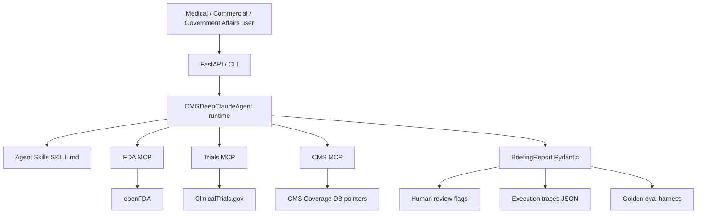

# Architecture

## Layers

1. **Interface** — CLI + FastAPI (`/v1/briefing`, `/tools`, `/skills`, `/workflows/{id}`).
2. **Runtime** — workflow routing, tool selection, skill-guided procedures.
3. **MCP tools** — FDA labels/warnings, trial search, CMS coverage pointers.
4. **Skills** — packaged expertise (`label_extraction`, `evidence_synthesis`, `source_verification`, `escalation`).
5. **Trust** — citations, groundedness, human-review severities (`info` / `warn` / `block`).
6. **Eval** — golden tasks + pass gates + traces.

## Design choices

- **Deterministic path by default** so CI and demos work without API keys.
- **Offline fixtures** mirror real public schemas for Keytruda/Opdivo demos.
- **Coverage always escalates** — prototype never issues coverage determinations.
- **Superiority language is blocked** — forces human review instead of promotional claims.
